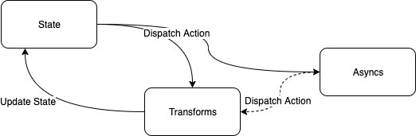

# Yet Another Modular State Management
YAMSM is a modular state management framework. YAMSM attempts to reduce the boilerplate that plague most state management frameworks. YAMSM serves as a centralized store for all the components in an application, with rules ensuring that the state can only be mutated in a predictable fashion. Take a look at the [Wiki](https://github.com/Warrenn/yamsm/wiki) for more information.
## Getting Started
The whole state of your app is stored in an object tree inside a single store. The only way to change the state tree is to dispatch an action, an object describing what happened. To specify how the actions transform the state tree, you write transforms. If your application has side effects (i.e. asyncronous tasks like data fetching) you write an async.
### Installation
```sh
npm i @warrennenslin/yamsm
```
### Define A Model
YAMSM is built with [Typescript Generics](https://www.typescriptlang.org/docs/handbook/generics.html) so the first step is to define the structure of your store's model. Just a note that YAMSM is a composable framework which allows you to combine multiple models to represent your store so you can compose your model from multiple model definitions if you so chose.
```typescript
export type ModelStore = {
    status: 'not started' | 'fetching' | 'complete'
    data: any[]
    hasErrors: boolean
    errorMessage: string
}
```
### Define A Builder
Before you can create a store instance you need to first create a [Builder](https://github.com/Warrenn/yamsm/wiki/Builder) the Builder allows you to define your [Transforms](https://github.com/Warrenn/yamsm/wiki/Transforms) and [Asyncs](https://github.com/Warrenn/yamsm/wiki/Async) as well as other directives which manage the behaviour of your store. Only once you created a store instance can you [Dispatch](https://github.com/Warrenn/yamsm/wiki/Store#dispatch) an action or [Watch](https://github.com/Warrenn/yamsm/wiki/Store#watch) for changes made to the store's state.
```typescript
//store.js
import { createStoreBuilder } from '@warrennenslin/yamsm'

export type ModelStore = {
    status: 'not started' | 'fetching' | 'complete'
    data: any[]
    hasErrors: boolean
    errorMessage: string
}

export const store = createStoreBuilder<ModelStore>()
    .addTransform("FETCH", ({ state }) => state.status = 'fetching')
    .addAsync("FETCH", async ({ dispatch, factory }) => {
        let service = factory.createService("SERVICE")
        let data = await service.fetchData()
        await dispatch("COMPLETE", data)
    })
    .addTransform("COMPLETE", ({ state, value }) => {
        state.status = 'complete'
        state.data = value
    })
    .addErrorHandler(({ error, state }) => {
        state.errorMessage = error.message
        state.hasErrors = true
    })
    .build()
```
What is happening here is when a "FETCH" action is dispatched the state of the store is set to "fetching". Then the async hook will intercept that same "FETCH" action and asyncronously call a service to fetch data. Important to note the order will always be Transform then Async. When the asyncronous fetchData function completes we dispatch the "COMPLETE" action with the data returned from the service. Async functions can never manipulate the state directly only Transforms can do that. When the "COMPLETE" action is dispatched the store is updated with a status set to "complete" and the data from the value of the action. If there is any exception thrown the error handler will set the hasErrors flag to true and the errorMessage property to the message of the error.
### Consume The Store
Once you have an instance of the [Store](https://github.com/Warrenn/yamsm/wiki/Store) with the behavior you require you can then go ahead and use the [Dispatch](https://github.com/Warrenn/yamsm/wiki/Store#dispatch) and [Watch](https://github.com/Warrenn/yamsm/wiki/Store#watch) functions of the store. The store's instance is a singleton and will keep its state throughout the lifetime of your app.
```typescript
import { store } from 'store'
import { Component, State, h } from '@stencil/core'

@Component({tag: 'custom-component'})
export class CustomComponent {
  @State() status: string
  @State() message: string
  @State() data: any[]
  @State() hasErrors: bool

  unsubscribe: any

  componentWillLoad() {
    this.unsubscribe = store.watch(({ state }) => {
        this.status = state.status
        this.message = state.errorMessage
        this.data = state.data
        this.hasErrors = state.hasErrors
    })
  }

  componentDidUnload() {
    this.unsubscribe && this.unsubscribe()
  }

  fetch() {
      store.dispatch('FETCH')
  }

  render() {
    return (
        <div>
            {this.message 
             ? <span>Error{ this.message }</span>
             : <span></span>
            }
            <span>Status{ this.status }</span>
            {this.data.map((item) =>
                <div>{ item }</div>
            )}
            <button onClick={() => this.fetch()}>Fetch</button>
        </div>
    );
  }
}
```
In this example we are using a [Stencijs Component](https://stenciljs.com/docs/component). First the store is imported from the store builder created earlier. With the store instance we can [Watch](https://github.com/Warrenn/yamsm/wiki/Store#watch) for changes to the state. The watch requires a callback function which is fired whenenver the state is changed passing in the new state of the store at the time of change. The return value of a watch is an unsubscribe function that is used when the component does its clean up to deregister the watch callback from the store and to stop listening for any further state changes. To initiate the "FETCH" workflow we define earlier in our [Builder](https://github.com/Warrenn/yamsm/wiki/Builder) we create a fetch function and call [Dispatch](https://github.com/Warrenn/yamsm/wiki/Store#dispatch) on our store instance to dispatch the "FETCH" action. When the state of the store is changed the watch callback will fire with the updated state consequently updating the state of the component.
## YAMSM State Management Lifecycle
