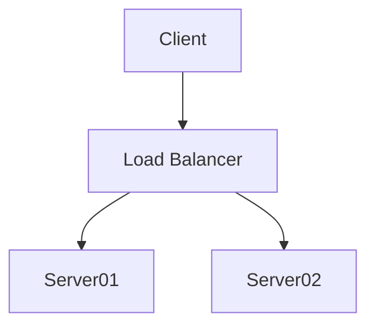

# Yet Another Modular State Management
YAMSM is a modular state management framework. YAMSM attempts to reduce the boilerplate that plague state management frameworks by adopting an API first design approach. YASMSM is built to be framework agnostic.
## Getting Started
### Installation
```sh
npm i @warrennenslin/yamsm
```
### Define Model
YAMSM is built with [Typescript Generics](https://www.typescriptlang.org/docs/handbook/generics.html) so the first step is to define the structure of your store's model. Just a note that YAMSM is a composable framework which allows you to combine multiple models to represent your store so you don't have to get the model right from the start you can instead compose your model from multiple model definitions if you so chose.
```typescript
export type ModelStore = {
    status: 'not started' | 'fetching' | 'complete'
    data: any[]
    hasErrors: boolean
    errorMessage: string
}
```
### Define Builder
YAMSM has two phases the [Build phase](https://todo) and the [Consume phase](https://TODO) the Build phase is where we define our [Transforms](https://TODO), [Syncs](https://TODO) etc... The Consume phase is where the UI interacts with the store via [Dispatch](https://TODO) and [Subcriptions](https://TODO) once the [Store](https://TODO) has been created.
```typescript

```
### Consume the Store
Once you have defined your [Store](https://TODO) with the [Modules](https://TODO) you require and built an instance of the store with the [StoreBuilder](https://TODO) you can then go ahead and use the [Dispatch](https://TODO) and [Subcriptions](https://TODO) functions of the store. The store is a singleton and will keep its state throughout the lifetime of your app.
```typescript
```
## Lifecycle
